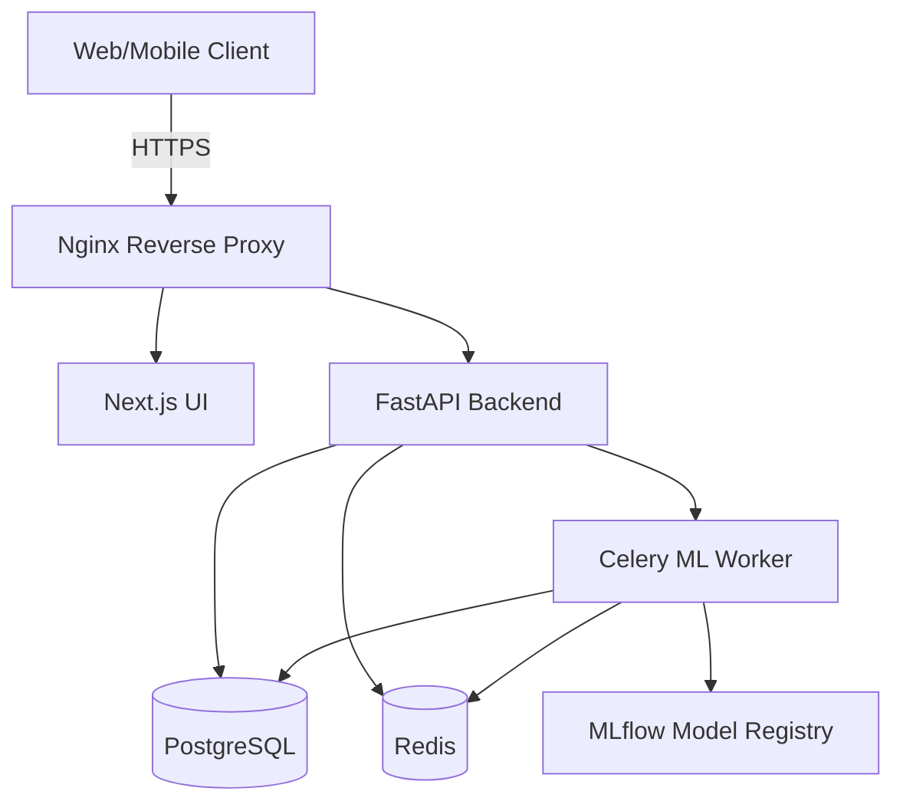

# Architecture

The **HealthMLCloudEngine** platform follows a modern microservices-oriented architecture adapted for cloud deployment.

## Components

### 1. Backend (FastAPI)
- Handles RESTful API requests.
- Validates data using Pydantic.
- Connects to PostgreSQL using SQLAlchemy ORM.
- **Why FastAPI?** Native async support and highly compatible with Python ML libraries (Scikit-learn, Pandas, MLflow).

### 2. Frontend (Next.js)
- Provides the Admin, Doctor, and ML Engineer dashboards.
- Uses React, TailwindCSS, and Next.js App Router for Server-Side Rendering (SSR).

### 3. Database Layer
- **PostgreSQL**: Stores relational data (Users, Hospitals, Patients, Appointments, EHR).
- **Redis**: Serves as a message broker for Celery and for caching predictions.

### 4. MLOps Pipeline
- **Celery**: Background workers for long-running model training jobs.
- **MLflow**: Tracks experiments, metrics (Accuracy, F1), and model artifacts.

## Deployment Architecture

## Security
- JWT-based stateless authentication.
- Role-Based Access Control (RBAC).
- Passwords hashed via Bcrypt.
